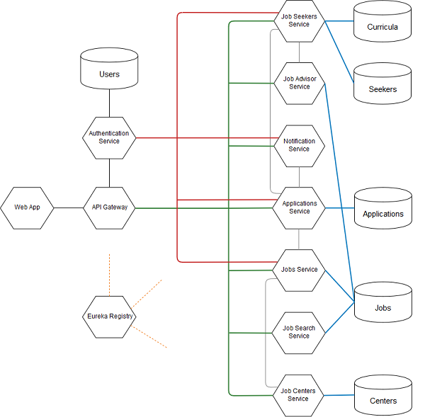

# Job Portal

Job Portal is an innovative website to search and post job offers, developed with state-of-the-art techonologies.

# Architecture


API Gateway is the service responsible for dispatching web requests to the correct service and managing authorization and filtering.  
Authentication service controls the authentication phase of every user.  
Job Centers service manages and exposes CRUD API for jobs centers.  
Jobs service manages and exposes CRUD API for job insertions.  
Applications service manages users' applications to jobs and exposes CRUD API for managing them.  
Notification service is responsible for notifying users of application confirmations and new job insertions and exposes API to send emails using Google Mail API.  
Job Advisor service computes skills-based suggestions and exposes API to provide them to the seeker.  
Job Seekers service manages job seekers and exposes the CRUD API.  
Job Search service allows browsing job offers and exposes the API to search.  

## Run

### Prerequisites

To run the whole application, a docker machine with at least 6500 MB of RAM is needed.
It is also recommended to set at least 4 GB of RAM to the docker deamon.

### Installing

To run the application, first clone git repository and `cd` into the docker folder inside the project and finally run `docker-compose`:

```
git clone https://gitlab.com/bcdl/jobportal.git

cd jobportal/docker

docker-compose build

docker-compose up

```

### Executing
As the services come up and start running, they register to Eureka Registry. To check if all the services are ready, navigate to this [address](http://localhost:8761).

When all the services are registered to Eureka Registry, the application is ready to be used at this [address](http://localhost:80).

## Built With

* [Spring Boot](https://spring.io/projects/spring-boot)
* [Maven](https://maven.apache.org/)
* [Docker](https://www.docker.com/) 
* [Flask](https://flask.pocoo.org/)
* [Postgres](https://www.postgresql.org/)

## Authors

* **Andrea Biaggi** - 794873
* **Matteo Coppola** - 793329
* **Lorenzo Di Vito** - 793128
* **Luca Lorusso** - 797805
